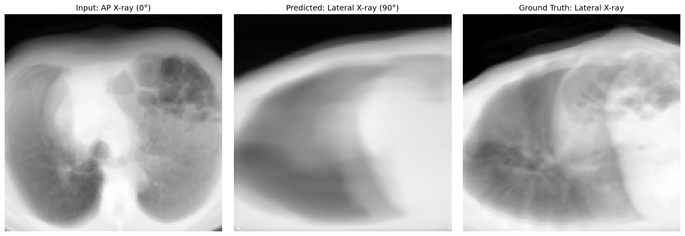
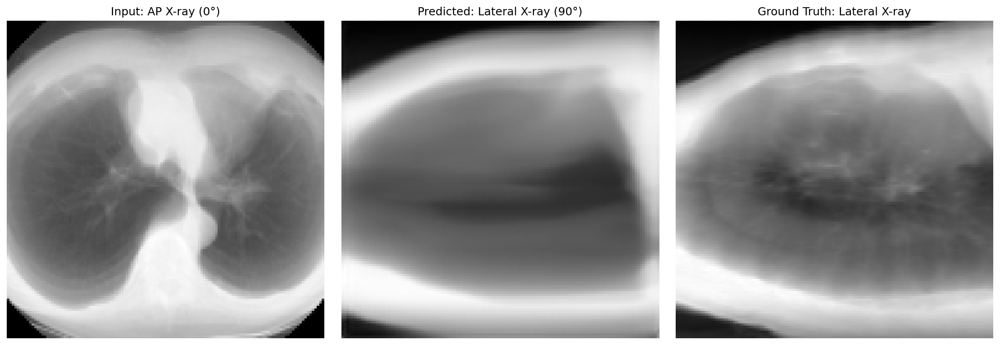
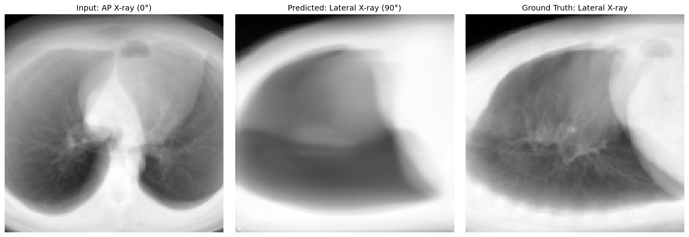
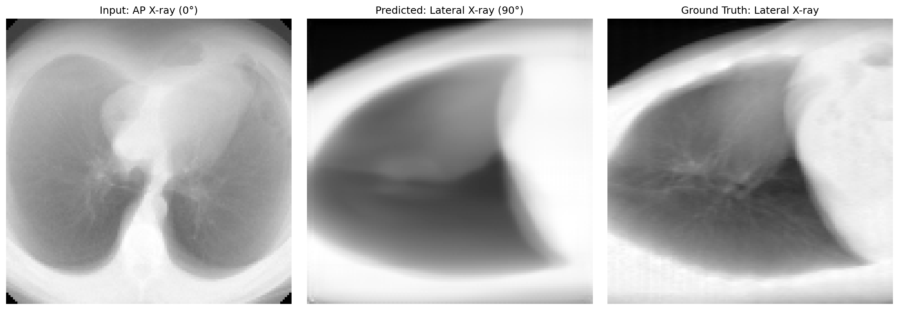

# X-ray View Synthesis from Single View

Implementation of **Section III-D: New X-ray View Synthesis** from the paper [arXiv:2503.17804](https://arxiv.org/pdf/2503.17804).

## Overview

This project implements a deep learning pipeline to synthesize novel X-ray views from a single projection. Given an AP (Anterior-Posterior, 0°) X-ray, the model predicts a Lateral (90°) X-ray view by:

1. **Back-projecting** the AP X-ray to a 3D volume (Equation 1 from the paper)
2. **Training a 3D U-Net** to reconstruct the full CT volume
3. **Forward-projecting** the predicted CT to generate the Lateral view (Equation 9 from the paper)

## Results

### Quantitative Metrics

| Metric | Our Result | Paper Target | Status |
|--------|------------|--------------|---------|
| **PSNR** | 22.38 ± 2.30 dB | > 17 dB | ✅ |
| **SSIM** | 0.780 ± 0.049 | > 0.7 | ✅ |

### Qualitative Results

Example synthesis result:


*Left: Input AP X-ray (0°) | Middle: Predicted Lateral X-ray (90°) | Right: Ground Truth Lateral X-ray*

<details>
<summary>View More Examples</summary>

|  |  |  |
|  |  |  |

</details>

## Architecture

```
┌─────────────┐
│  AP X-ray   │  Input: Single 2D projection (128×128)
│    (0°)     │
└──────┬──────┘
       │
       ▼
┌─────────────┐
│ Back-Project│  Equation 1: 2D → 3D volume
└──────┬──────┘
       │
       ▼
┌─────────────┐
│  3D U-Net   │  Predict full CT volume (128×128×128)
│ (Trained)   │
└──────┬──────┘
       │
       ▼
┌─────────────┐
│Forward-Proj │  Equation 9: Generate novel view at 90°
└──────┬──────┘
       │
       ▼
┌─────────-────┐
│ Lateral X-ray│ Output: Synthesized 2D projection (128×128)
│    (90°)     │
└──────────-───┘
```

## Project Structure

```
xray-synthesis/
├── preprocess.py         # DICOM → normalized numpy volumes
├── projection.py         # Forward/back-projection operations
├── model.py              # 3D U-Net architecture
├── dataset.py            # PyTorch dataset loader
├── train.py              # Training script
├── test.py               # Generate predictions
├── evaluate_metrics.py   # Calculate PSNR/SSIM metrics
├── main.py               # Complete pipeline orchestrator
├── requirements.txt      # Python dependencies
├── README.md             # This file
├── LIDC-IDRI/            # Raw dicom CT volumes
│   ├── X.X.X....XXXX
│   │   ├── 1-001.dcm
│   │   ├── 1-002.dcm
│   │   ├── ...
│   └── ...
├── processed_volumes/    # Preprocessed CT volumes
│   ├── volume_000.npy
│   ├── ...
│   └── manifest.json
├── checkpoints/          # Trained models
│   └── best_model.pth
└── results/              # Test outputs
    ├── example_00.png
    ├── example_00.npz
    ├── ...
    └── metrics.json
```

## Quick Start

### 1. Installation

```bash
# Clone repository
git clone https://github.com/cgmaiorano/xray_synthesis.git
cd xray_synthesis

# Install dependencies
pip install -r requirements.txt
```

### 2. Data Preparation

Download LIDC-IDRI dataset and preprocess:

```bash
python download_data.py
```
```bash
python main.py --preprocess \
    --data_dir ./LIDC-IDRI/ \
    --processed_dir ./processed_volumes/ \
    --num_volumes 200
```

### 3. Training

```bash
python main.py --train \
    --processed_dir ./processed_volumes/ \
    --output_dir ./checkpoints/ \
    --epochs 100 \
    --batch_size 1
```

**Training Configuration:**
- Model: 3D U-Net with features [32, 64, 128, 256]
- Loss: L1 (MAE) between predicted and ground truth CT
- Optimizer: Adam (lr=1e-4)
- Scheduler: ReduceLROnPlateau
- Train/Val Split: 80/20 (160/40 volumes)
- Hardware: GPU recommended (CUDA)

### 4. Test

Generate 10 test examples:

```bash
python main.py --test \
    --model_path ./checkpoints/best_model.pth \
    --data_dir ./processed_volumes/ \
    --output_dir ./results/ \
    --num_examples 10
```

### 5. Evaluation

Calculate metrics:

```bash
python main.py --evaluate \
    --results_dir ./results/
```
## Complete Pipeline Command

Run the entire pipeline in one command:

```bash
python main.py --preprocess --train --test --evaluate \
    --data_dir ./LIDC-IDRI/ \
    --num_volumes 200 \
    --epochs 100 \
    --num_examples 10
```

## Dataset

**Source:** LIDC-IDRI (Lung Image Database Consortium)

**Preprocessing:**
- Input: DICOM CT scans
- Normalization: HU window [-600, 900] (lung window)
- Resampling: 2mm isotropic spacing
- Size: 128³ voxels
- Split: 160 training / 40 test volumes

## Method Details

### Forward Projection (DRR Generation)

Digitally Reconstructed Radiographs simulate X-ray imaging:

```python
# Equation 9: I(u,v) = ∫ V(x,y,z) dz
I_AP = volume.sum(axis=0)      # Sum along depth (AP view)
I_LAT = volume_rotated.sum(axis=0)  # After 90° rotation (Lateral view)
```

### Back Projection

Naive 3D reconstruction by replicating 2D projection:

```python
# Equation 1: V(x,y,z) = I(x,y) for all z
volume_backproj = xray[:, :, np.newaxis].repeat(depth, axis=2)
```

### 3D U-Net Training

**Objective:** Learn mapping from back-projected volume → full CT

```python
Input:  back_projected_volume  # (1, 128, 128, 128) - low quality 3D
Target: original_ct_volume     # (1, 128, 128, 128) - ground truth 3D
Loss:   L1(predicted_ct, original_ct)
```

## Performance

### Training Progress

- **Epochs:** 100
- **Best Validation Loss:** 0.0834 
- **Training Time:** ~20 hours

## Citation

If you use this code, please cite the original paper


## Requirements

- Python >= 3.8
- PyTorch >= 2.0.0
- CUDA >= 11.0 (for GPU training)
- See `requirements.txt` for full dependencies

## 📄 License

This project is licensed under the MIT License - see LICENSE file for details.

---
